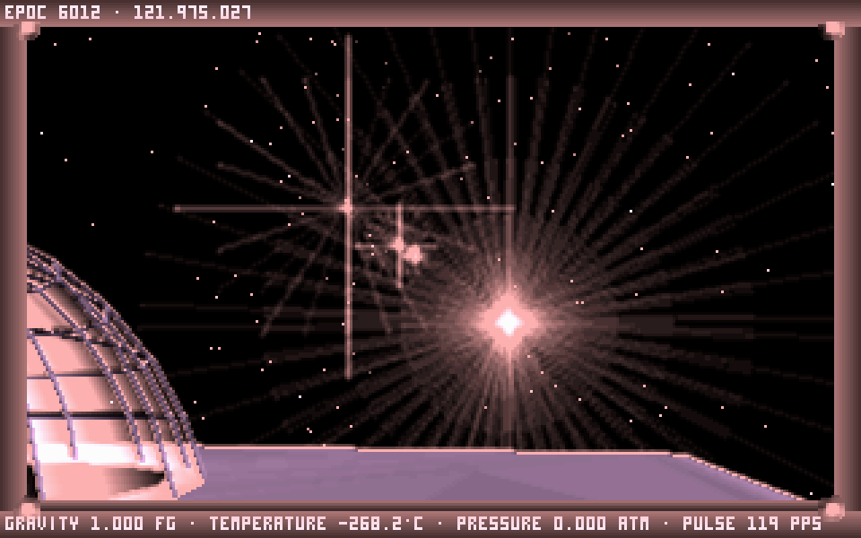

# Noctis IV LR



**PLEASE NOTE: This project is a heavy WIP. It is unstable and unfinished**

Noctis IV LR aims to eventually port Noctis IV to run on Linux and Modern Windows.
The starting point was the base Noctis IV source code. Neither NIV+ nor
NICE were used because the added layer of cruft on top of both would have
made the work of porting it more difficult. The bugs fixed by NIV+, however, will
all also be fixed in Noctis IV LR before a stable release.

The goal for Noctis IV LR is to maintain compabitility with the original Noctis IV.
That means that stars should generate in the same positions, and planets should
look the same. Stars do currently generate in the correct positions, but there
may be problems with compatibility down the line. 

Currently, Noctis IV LR only runs on Linux and is using SDL2 for the windowing and
drawing. It will support windows eventually, but that will not be a priority until the 
game itself is fully implemented.

## Compiling
The CMake file is set up to use clang, but it probably works fine with GCC as well.
The only dependency is SDL2.
To build, run the following commands:
```
mkdir build && cd build && cmake .. && make && ln -sf ../res res
```

## Port Status

The majority of the 3D rendering code has been ported, and all of the non-planetary game logic has been ported. Routines
dealing with rendering planets / stars and rendering the ground when landed still have to be implemented. GOES.net modules
and saving / loading are also not currently working but are low priority. There are also some serious timing issues from
the game being designed to run at ~24 FPS.

## Differences from Vanilla
* SUPPORTS.NCT is loaded from the res/ folder instead of being appended to the binary.
* Fixed a bug with triads dexter above 1000. 

## License
Released under the terms of the [WTOF Public License](LICENSE.md) under Alex's conditions that the original gameplay be preserved.
